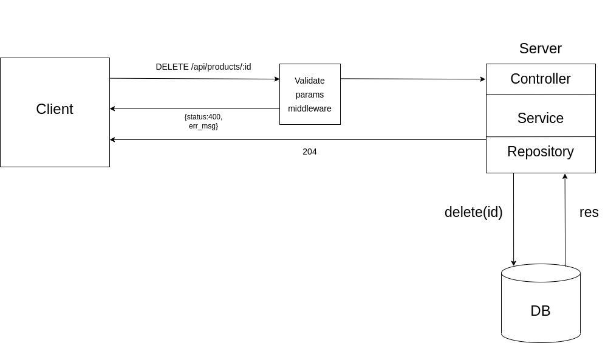

# Products REST API

## Description

Simple REST API.

## Techstack

- `Express`
- `Typescript`
- `Mongodb`
- `Mongoose`

## Table of contents

- [Prerequisities](#prerequisities)
- [Usage](#usage)
- [Postman collection](#postman-collection)
- [Architecture](#architecture)
- [API](#api)

## Prerequisities

- `node` installed
- `http client`

## Usage

### Clone repository

```
git clone https://github.com/wojciechszmelczerczyk/ts-express-products-api.git
```

### Navigate to folder

```
cd /ts-express-products-api
```

### Install dependencies

```
npm i
```

### Env

Create `.env` file in project root directory.

```dockerfile
# Some port number
PORT=

# MongoDB uri
DB_URI=
```

### Run REST API

```
npm run dev
```

## Postman collection

You can import provided [postman collection](./ts-express-products-api.postman_collection.json) to test api.

## Architecture

### Introduction

Library used to develop app architecture [routing-controllers](https://github.com/typestack/routing-controllers). REST API using `Controller`, `Service` and `Repository` approach.

GET `/api/products`

User send request to the server, server query database and find all products.

<details>

<summary>Example</summary>


</details>
<br/>

GET `/api/products/:id`

User send request to the server with provided id parameter.

[Middleware](./middlewares/ValidateIdMiddleware.ts) validate if provided id has correct syntax.

If syntax is incorrect API returns `400` with error message.

If provided id has correct syntax, middleware pass handler to the server.

Server try to query product with specific id from database.

If product doesn't exist, API respond with `400` and error message.

<details>

<summary>Example</summary>


</details>
<br/>

POST `/api/products`

User send request to the server with `name` and `price` data.

If no data provided or data is invalid, [error middleware](./middlewares/ErrorMiddleware.ts) intercept error, modify error message and return to the client with `400` status.

Otherwise new product is being returned.

<details>

<summary>Example</summary>


</details>
<br/>

PUT `/api/products/:id`

User send request to the server with `id` parameter and `name`, `price` data.

[Middleware](./middlewares/ValidateIdMiddleware.ts) validate if provided id has correct syntax.

If syntax is incorrect API returns `400` with error message.

If no data provided or data is invalid, [error middleware](./middlewares/ErrorMiddleware.ts) intercept error, modify error message and return to the client with `400` status.

Otherwise updated product is being returned.

<details>

<summary>Example</summary>


</details>
<br/>

DELETE `/api/products/:id`

User send request to the server with `id` parameter.

[Middleware](./middlewares/ValidateIdMiddleware.ts) validate if provided id has correct syntax.

If syntax is incorrect API returns `400` with error message.

Otherwise handler is being passed to controller where server validate if product with provided id exists.

If not `400` with error message is returned.

When deletion of product is successful, server respond with `204` status.

<details>

<summary>Example</summary>


</details>
<br/>

## API

| Method |                 Endpoint                 |
| :----: | :--------------------------------------: |
|  GET   |     [`/api/products`](./docs/get.md)     |
|  GET   | [`/api/products/:id`](./docs/getById.md) |
|  POST  |    [`/api/products`](./docs/post.md)     |
|  PUT   |   [`/api/products/:id`](./docs/put.md)   |
| DELETE | [`/api/products/:id`](./docs/delete.md)  |
